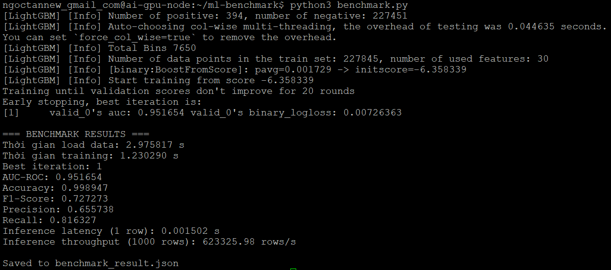
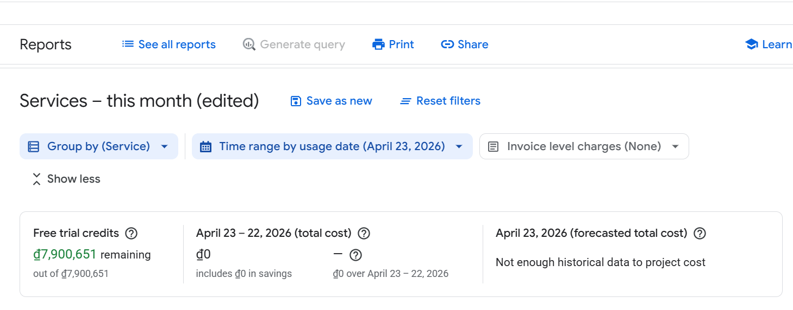

# Report nộp bài Lab

## 1. Screenshot terminal chạy `python3 benchmark.py`

### Benchmark


---

## 2. File `benchmark_result.json`

**Đính kèm file:** `./terraform-gcp/benchmark_result.json`

---

## 3. Screenshot GCP Billing Reports sau 1 giờ triển khai



> **Ghi chú:** Tại thời điểm chụp màn hình, Google Cloud Billing Reports vẫn chưa hiển thị chi phí phát sinh và vẫn hiện `₫0`, dù hạ tầng đã được triển khai thành công và benchmark đã chạy xong. Điều này nhiều khả năng do độ trễ cập nhật của Google Cloud Billing.

---

## 4. Mã nguồn thư mục `terraform-gcp/` đã chỉnh sửa

**Yêu cầu:** Nộp mã nguồn thư mục `terraform-gcp/` với các chỉnh sửa cho phương án CPU fallback.

### Đoạn cấu hình đã chỉnh sửa

```hcl
# guest_accelerator {
#   type  = var.gpu_type
#   count = var.gpu_count
# }

# scheduling {
#   on_host_maintenance = "TERMINATE"
#   automatic_restart   = true
# }

scheduling {
  on_host_maintenance = "MIGRATE"
  automatic_restart   = true
}

## 5. Báo cáo ngắn

Kết quả training trên CPU có training time cao hơn so với cấu hình dùng GPU, nhưng đổi lại chi phí triển khai thấp hơn và phù hợp với yêu cầu tối ưu ngân sách cho bài lab. Chỉ số AUC về nguyên tắc không phụ thuộc trực tiếp vào việc dùng CPU hay GPU, vì đây là khác biệt ở phần cứng tính toán chứ không phải thay đổi thuật toán huấn luyện; do đó nếu dữ liệu và pipeline giữ nguyên thì AUC thường gần như không đổi. Inference speed trên CPU chậm hơn GPU do khả năng xử lý song song kém hơn, dẫn đến latency cao hơn. Lý do phải dùng CPU thay GPU thường đến từ giới hạn quota, không đủ GPU quota trong project, hoặc để giảm chi phí vận hành trong quá trình thử nghiệm. Ngoài ra, với workload benchmark nhỏ hoặc mục tiêu chính là kiểm chứng pipeline, CPU vẫn đủ để chạy và dễ cấp phát tài nguyên hơn. Vì vậy, lựa chọn CPU trong bài này là sự đánh đổi giữa tốc độ và tính khả dụng/chi phí.

---


